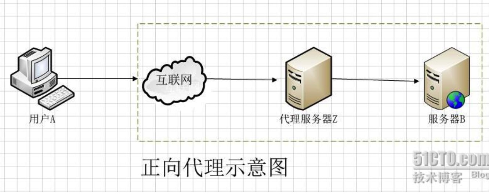
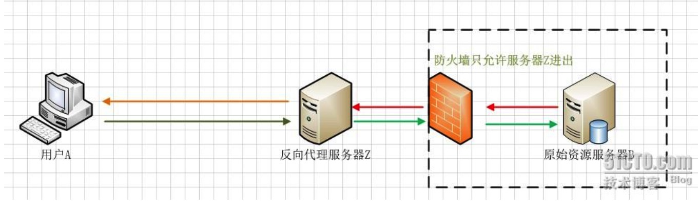

# 正向代理 反向代理

正向代理：是一个位于客户端【用户A】和原始服务器【服务器B】之间的服务器【代理服务器Z】。为了从原始服务器上获取内容，用户A向代理服务器Z发送一个请求并指定目标(服务器B),然后代理服务器Z向服务器B转交请求并将获得的内容返回给客户端。客户端必须要进行一些特别的设置才能使用正向代理。
所谓的正向代理就是代理服务器代理用户访问目标服务器。现实中的例子就是【翻墙】。一旦代理服务器被 ZF 控制，就不能访问外网了。

反向代理：对客户端而言反向代理服务器就像是目标服务器，客户端不需要做任何的配置。客户端向反向代理服务器发送请求，反向代理将判断向何处（目标服务器）转发请求，并将获得的内容返回给客户端

用户A始终认为它访问的是代理服务器Z而不是原始服务器B，但实际上反向代理服务器接受用户A的应答，从原始资源服务器B中取得用户A的需求资源，然后发送给用户A。由于防火墙的作用，只允许代理服务器Z访问原始资源服务器B。尽管在这个虚拟的环境下，防火墙和反向代理的共同作用保护了原始资源服务器B，但用户A并不知情。

实际案例：互联网要访问局域网内的内容

[参考：前端工程师学习Nginx入门篇](http://cnt1992.xyz/2016/03/18/simple-intro-to-nginx/)