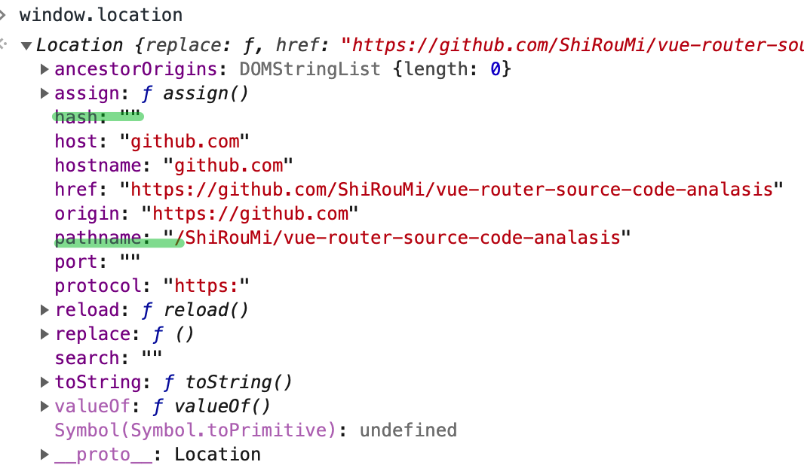

# window 对象


## window and Window
`Window`
```js
f Window() 
PERSISTENT: 1
TEMPORARY: 0
arguments: null
caller: null
length: 0
name: "Window"
prototype: Window {TEMPORARY: 0, PERSISTENT: 1, constructor: ƒ, Symbol(Symbol.toStringTag): "Window"}
__proto__: ƒ EventTarget()
[[Scopes]]: Scopes[0]
```
`Window` 是接口，`window` 是实例，全局变量是 window 的属性。

## scrollY
返回文档在垂直方向已滚动的像素值。

别名： `pageYOffset`

## scrollX
返回文档/页面水平方向滚动的像素值。

别名： `pageXOffset`

## document
`window.document`
指向当前窗口内的文档节点.

## history
`window.history`

一个只读属性，用来获取History 对象的引用，History 对象提供了操作浏览器会话历史（浏览器地址栏中访问的页面，以及当前页面中通过框架加载的页面）的接口。

## inner​Height
`window.innerHeight`
浏览器窗口的视口（viewport）高度（以像素为单位）；如果有水平滚动条，也包括滚动条高度。

## inner​Width
`window.innerWidth`
浏览器视口（viewport）宽度（单位：像素），如果存在垂直滚动条则包括它。

## navigator
`window.navigator`
只读属性, 会返回一个 Navigator 对象的引用，可以用于请求运行当前代码的应用程序的相关信息。

## clearInterval clearTimeout

## set​Interval set​Timeout

## requestAnimationFrame
告诉浏览器——你希望执行一个动画，并且要求浏览器在下次重绘之前调用指定的回调函数更新动画。该方法需要传入一个回调函数作为参数，该回调函数会在浏览器下一次重绘之前执行。
当你准备更新动画时你应该调用此方法。这将使浏览器在下一次重绘之前调用你传入给该方法的动画函数(即你的回调函数)。回调函数执行次数通常是每秒60次，但在大多数遵循W3C建议的浏览器中，回调函数执行次数通常与浏览器屏幕刷新次数相匹配。

`window.requestAnimationFrame(callback);`

## location
`window.location` 只读属性，返回一个 `Location` 对象，其中包含有关文档当前位置的信息。
比如在前端路由的使用中
- hash 路由获取 hash 值 `window.location.hash`
- history 路由获取到对象的位置 `window.location.pathname`

