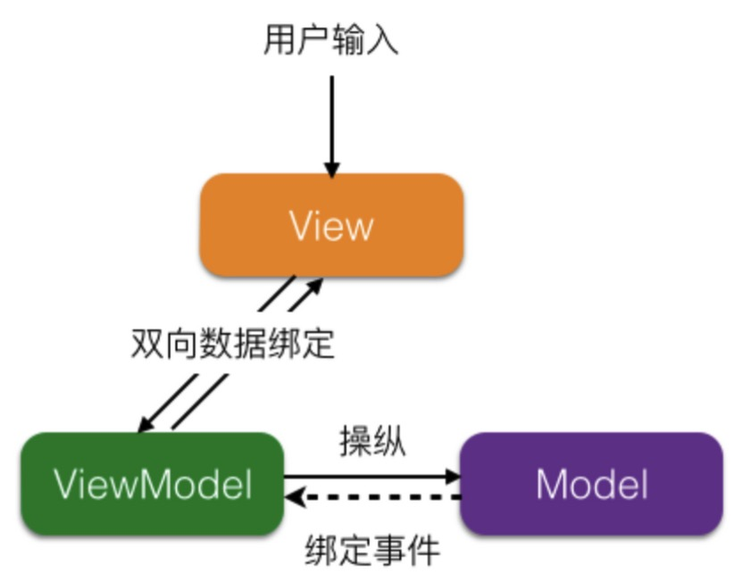
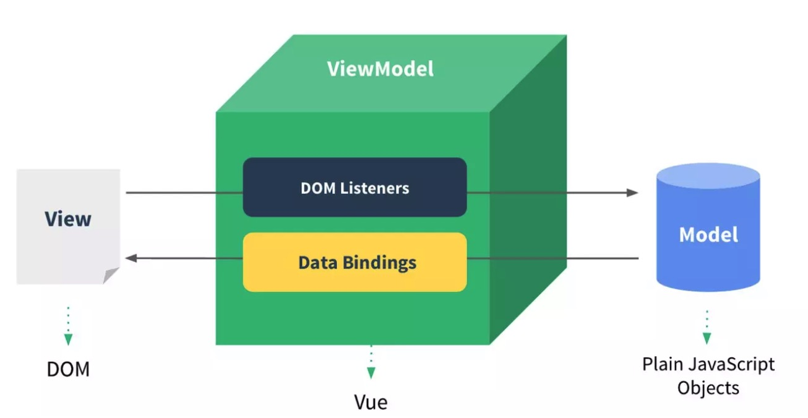

# MVVM
## 区别 MVC MVP MVVM
- MVC
  - Model: 模型，保存数据
  - View: 视图，用户界面
  - Controller: 控制器，业务逻辑
  - 通信方式：单向
    - View -> Controller
    - Controller -> Model
    - Model -> View
- MVP
  - Presenter
  - 各部分之间的通信，都是双向的
  - View 与 Model 不发生联系，都通过 Presenter 传递。
- MVVM
  - ViewModel

## MVC
通过 Model & View 完成了数据从模型层到视图层的逻辑。但是对于一个应用程序来说，这是远远不够的，我们还需要**响应用户的操作、同步更新 View 与 Model**。于是，在 MVC 中引入了控制器 Controller，它用来定义界面对用户输入的响应方式，连接了 Model 和 View，用户控制应用程序的流程，处理用户的行为和数据上的改变。

## MVVM
MVVM: Model-View-ViewModel，是一种前端开发的架构模式，核心是提供对 View-ViewModel 的双向数据绑定。

在 MVVM 架构下，View 和 Model 之间没有直接的联系，通过 ViewModel 进行交互。

双向数据绑定，View 层的变动自动反应在 ViewModel; ViewModel 的变动，自动反应在 View

- Model: 用于封装应用程序中业务逻辑相关的数据以及对数据的处理方法
- View: 负责数据的展示

## Vue 没有完全遵循 MVVM 模型
- MVVM 在 Vue 中的体现？
- Vue 哪些地方违背了 MVVM

Vue 与 MVVM 的对应
- Model：对应组件中 data、props 等
- View: 对应 template 
- ViewModel: **继承 Vue 类的组件实例**

Vue 中的有些操作可以绕开 ViewModel 访问 View，所以 Vue 没有完全遵循 MVVM 模型。严格的 MVVM 要求 View 与 Model 不能直接通信。
- 提供了 $refs 属性，让 Model 可以直接操作 View ？？
- Vue.nextTick
- etc

### 疑问？
- Vue 与 MVVM 的对应
- 为什么说 Vue 没有完全遵循 MVVM 模型
- 数据劫持、模板编译...

### 参考
- [浅析前端开发中的 MVC/MVP/MVVM 模式](https://juejin.im/post/593021272f301e0058273468#heading-11)
- [MVC，MVP 和 MVVM 的图示](http://www.ruanyifeng.com/blog/2015/02/mvcmvp_mvvm.html)
- [浅谈 MVC、MVP 和 MVVM 架构模式](https://draveness.me/mvx)