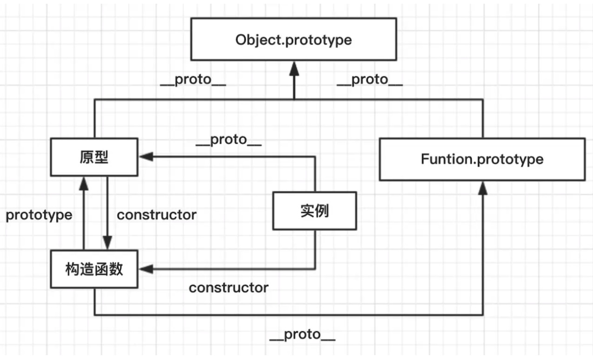
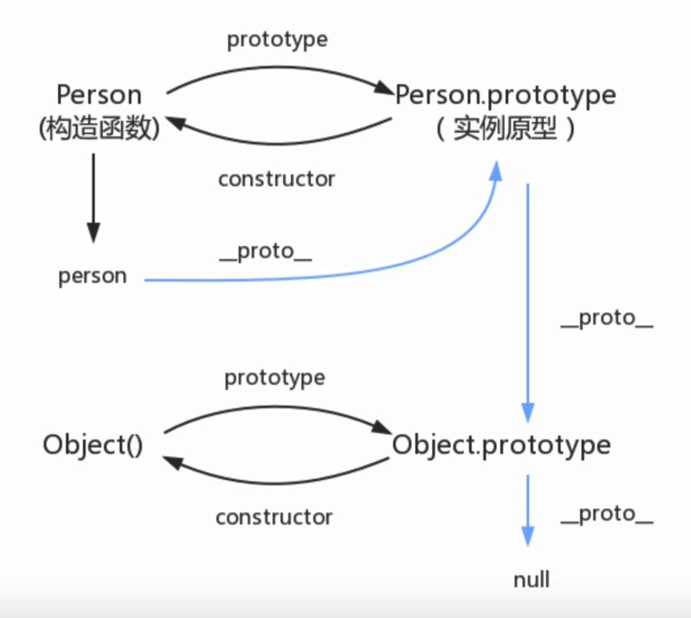
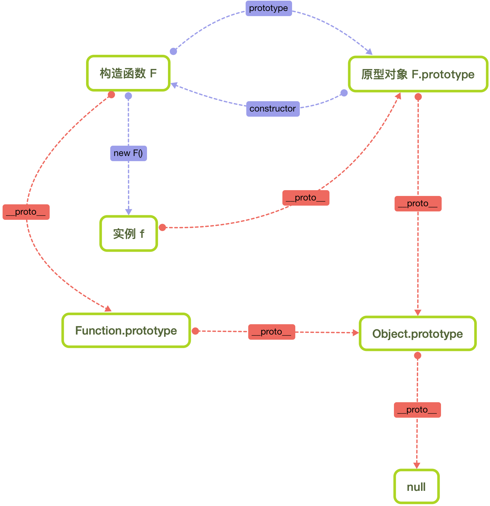

# 原型与原型链

> 原型

- js 通过构造函数生成新对象，实例对象的属性和方法，定义在构造函数内部
- 通过构造函数为实例对象定义属性，问题是：同一个构造函数的多个实例之间，无法共享属性，造成了系统资源的浪费
- js 继承机制的设计思想是：原型对象的所有属性和方法，都能被实例对象共享。也就是说，如果属性和方法定义在原型上，那么所有实例对象都能共享，这样节省了内存，还体现了实例对象之间的联系。
- js 规定，每个函数都有一个 prototype 属性，指向一个对象。对于普通函数来说，这个属性没有什么用处。但是对于构造函数，生成实例的时候，该属性会自动成为实例对象的原型。
- 当实例对象没有某个属性或方法时，它会到原型对象上查找属性和方法
- 原型对象的作用，就是定义所有实例对象共享的属性和方法
- 每一个 js 对象（null except)在创建的时候都会与之关联一个对象，即原型。每一个对象都从原型中继承属性
- 每一个 js 对象（null except) 都有一个属性，`__proto__`， 这个属性指向该对象的原型
- 只有 函数 才有 prototype 属性，（通过 `Function.prototype.bind` 方法构造出来的函数是个例外）

> 原型链

- 当谈到继承时，JavaScript 只有一种结构：对象。每个实例对象（object ）都有一个私有属性（称之为 `__proto__`）指向它的原型对象（`prototype`）。该原型对象也有一个自己的原型对象( `__proto__` ) ，层层向上直到一个对象的原型对象为 null。根据定义，null 没有原型，并作为这个原型链中的最后一个环节。
- 所有对象都继承了 `Object.prototype` 的属性。这就是所有对象都有 `valueOf` 和 `toString` 方法的原因，因为这是从 Object.prototype 继承的
- `Object.prototype` 的原型是 null。null 没有任何属性和方法，也没有自己的原型。因此，原型链的尽头就是 null。
- 读取对象的某个属性时，JavaScript 引擎先寻找对象本身的属性，如果找不到，就到它的原型去找，如果还是找不到，就到原型的原型去找。如果直到最顶层的 `Object.prototype` 还是找不到，则返回undefined。如果对象自身和它的原型，都定义了一个同名属性，那么优先读取对象自身的属性
- 一级级向上，在整个原型链上寻找某个属性，对性能是有影响的。所寻找的属性在越上层的原型对象，对性能的影响越大。如果寻找某个不存在的属性，将会遍历整个原型链。

> constructor

- prototype 对象有一个 constructor 属性，默认指向 prototype 对象所在的构造函数。
- 由于 constructor 属性定义在 prototype 对象上面，意味着可以被所有实例对象继承。
- constructor 属性的作用是，可以得知某个实例对象，到底是哪一个构造函数产生的
- constructor 属性表示原型对象与构造函数之间的关联关系，如果修改了原型对象，一般会同时修改 constructor 属性，防止引用的时候出错。

> instanceof

- instanceof 运算符返回一个布尔值，表示对象是否为某个构造函数的实例。
- instanceof 运算符的左边是实例对象，右边是构造函数。
- instanceof 检查整个原型链
- instanceof 的原理是检查右边构造函数的 prototype 属性，是否在左边对象的原型链上。
- instanceof 运算符的一个用处，是判断值的类型。
- instanceof 运算符只能用于对象，不适用原始类型的值。
- 利用 instanceof 运算符，还可以巧妙地解决，调用构造函数时，忘了加 new 命令的问题。

原型链图一：

原型链图二：

原型链图三：

资料参考
- [从__proto__和prototype来深入理解JS对象和原型链](https://github.com/creeperyang/blog/issues/9)
- [万物皆空之 JavaScript 原型](https://ulivz.com/2016/12/20/javascript-prototype/)
- [object layout](http://www.mollypages.org/tutorials/js.mp)
- [prototype 对象---阮一峰](https://javascript.ruanyifeng.com/oop/prototype.html)
- [JavaScript深入之从原型到原型链](https://github.com/mqyqingfeng/Blog/issues/2)