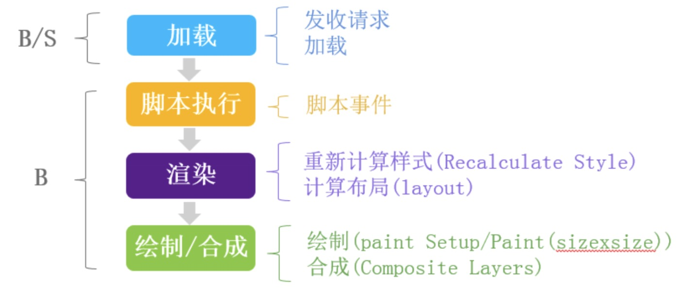
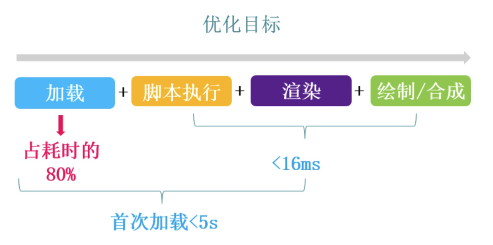
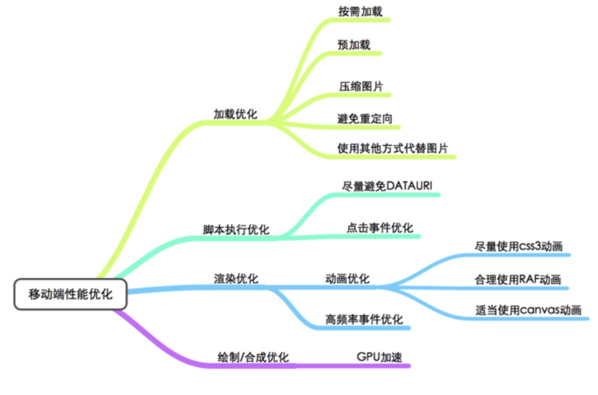

# 性能优化
> - 浏览器性能问题
> - 平时你怎么优化的？ 怎么优化首屏？ 怎么优化长列表 ? 动画你怎么优化的
> - dns预解析是什么，怎么设置
> - cdn是什么，cdn原理
> - 重排和重绘怎么避免 ? 重绘与回流
> - 项目中的性能优化
> - 一个页面中有大量数据，如何优化页面
> - 一个页面中有大量图片，如何优化页面
> - 图片除了雪碧图，其他优化方案
> - 单页应用的首屏优化

> PC 端性能优化

PC 端页面性能优化分网络加载类、页面渲染类、CSS 优化类、JavaScript 执行类、缓存类、图片类、架构协议类等几类。

前端性能的一个重要指标是 「页面加载时间」，事关用户体验。

- 减少 HTTP 请求数
- 避免重定向
- 延迟加载
- 减少 DOM 数量
- 划分内容到不同的域名
- 添加 Expires 或者 Cache-Control响应头
- 启用 Gzip
- 配置 Etag
- 避免图片 scr 为空，图片 src 为空的话，浏览器仍旧会向服务器发起请求
- 减少 Cookie 大小，去除不必要的 Cookie
- JS 放在页面底部

> 移动端性能优化

移动页面布局越来越复杂，效果越来越炫，直接导致了文件越来越大，下载和运行速度越来越低，而速度低会造成不良影响。移动页面的速度跟三个因素有关，分别是：移动网络带宽速度，设备性能（CPU，GPU，浏览器），页面本身。

我们能做得是对移动端页面本身优化。pc常用的优化手段：
- 代码优化（css、html、js优化）
- 减少HTTP请求（雪碧图，文件合并）
- 减少DOM节点
- 无阻塞（内联CSS，JS置后）
- 缓存
这些手段大部分适用于移动端。
一个页面从开始到呈现完毕需要经历什么阶段，主要有四个阶段：

我们的优化目标：

> 加载中的优化手段

- 预加载
    - 显性加载
    - 隐性加载
- 按需加载
- 压缩图片
- 尽量避免重定向
- 使用其他方式代替图片
    - 依靠 CSS3 绘制
    - 使用 iconfont 代替

> 脚本中优化手段

- 尽量避免DataURI
- 点击事件优化
    - 在移动端请适当使用touchstart，touchend，touch等事件代替延迟比较大的click事件。Click之所以慢是因为mousedown导致的

> 渲染阶段优化手段

- 动画优化
    - 尽量使用 CSS3 动画
    - 适当使用canvas动画
    - 合理使用RAF(requestAnimationFrame)
- 高频事件优化
    - 使用requestAnimationFrame监听帧变化，使得在正确的时间进行渲染
    类似touchmove，scroll这类的事件可导致多次渲染，对于这种事件可以通过以下手段进行优化：
    1. 使用requestAnimationFrame监听帧变化，使得在正确的时间进行渲染
    2. 增加响应变化的时间间隔，减少重绘次数
