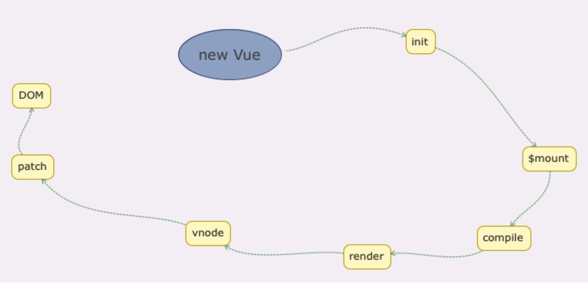

# Vue 数据驱动
Vue.js 一个核心思想是数据驱动。
所谓数据驱动，是指视图是由数据驱动生成的，我们对视图的修改，不会直接操作 DOM，而是通过修改数据。它相比我们传统的前端开发，如使用 jQuery 等前端库直接修改 DOM，大大简化了代码量。特别是当交互复杂的时候，只关心数据的修改会让代码的逻辑变的非常清晰，因为 DOM 变成了数据的映射，我们所有的逻辑都是对数据的修改，而不用碰触 DOM，这样的代码非常利于维护。

Vue.js 中我们采用简洁的「模板语法」来声明式的将数据渲染为 DOM

数据驱动
- 视图是由数据驱动生成的
- 数据更新驱动视图的变化

> 那么 模板和数据 是如何渲染成 DOM 的呢？

