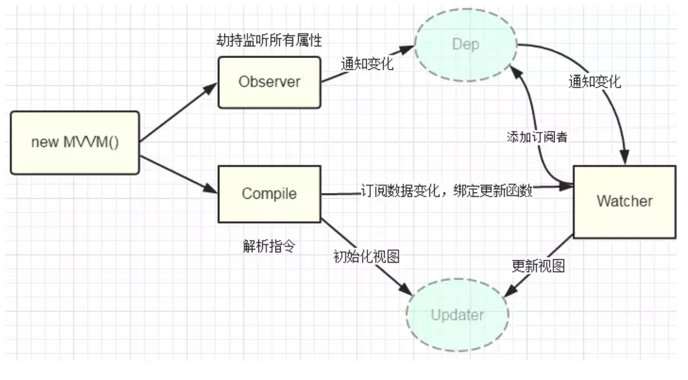
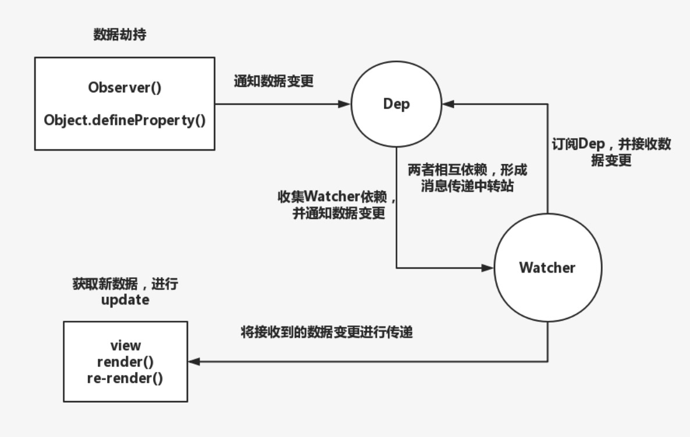

# 观察者模式
Q: 观察者模式 与 发布--订阅模式 是否一致？
[参考讨论](https://github.com/Advanced-Frontend/Daily-Interview-Question/issues/25)

> 概念

观察者模式（Observer）：通常又被称作为发布-订阅者模式。它定义了一种一对多的依赖关系，即当一个对象的状态发生改变的时候，所有依赖于它的对象都会得到通知并自动更新，解决了主体对象与观察者之间功能的耦合。

一对多的关系：
- 观察者：被观察的对象
- 订阅者：订阅观察者的一个个对象

Vue 中对于观察者模式的应用：数据初始化



```js
var vm = new Vue({
  data () {
    return {
      a: 'hello vue'
    }
  }
})
```
目录：
- 实现数据劫持
  - 递归遍历
  - 发布|订阅
  - 返回 Observer 实例
- 消息封装，实现中转站
  - Dep
  - Watcher

> 实现数据劫持

vue 是利用的是 `Object.defineProperty()` 对数据进行劫持。 并在数据传递变更的时候封装了一层中转站，即我们看到的 Dep 和 Watcher 两个类。

```js
// 递归遍历
walk (obj: Object) {
  const keys = Object.keys(obj)
  // 遍历将其变成 vue 的访问器属性
  for (let i = 0; i < keys.length; i++) {
    defineReactive(obj, keys[i], obj[keys[i]])
  }
}

// 设置为访问器属性，并在其 getter 和 setter 函数中，使用发布/订阅模式，互相监听。
export function defineReactive (
  obj: Object,
  key: string,
  val: any
) {
  // 这里用到了观察者（发布/订阅）模式进行了劫持封装，它定义了一种一对多的关系，让多个观察者监听一个主题对象，这个主题对象的状态发生改变时会通知所有观察者对象，观察者对象就可以更新自己的状态。
  // 实例化一个主题对象，对象中有空的观察者列表
  const dep = new Dep()
  
  // 获取属性描述符对象(更多的为了 computed 里面的自定义 get 和 set 进行的设计)
  const property = Object.getOwnPropertyDescriptor(obj, key)
  if (property && property.configurable === false) {
    return
  }

  const getter = property && property.get
  const setter = property && property.set
  
  let childOb = observe(val)
  Object.defineProperty(obj, key, {
    enumerable: true,
    configurable: true,
    // 收集依赖，建立一对多的的关系，让多个观察者监听当前主题对象
    get: function reactiveGetter () {
      const value = getter ? getter.call(obj) : val
      if (Dep.target) {
        dep.depend()
        if (childOb) {
          childOb.dep.depend()
          // 这里是对数组进行劫持
          if (Array.isArray(value)) {
            dependArray(value)
          }
        }
      }
      return value
    },
    // 劫持到数据变更，并发布消息进行通知
    set: function reactiveSetter (newVal) {
      const value = getter ? getter.call(obj) : val
      if (newVal === value || (newVal !== newVal && value !== value)) {
        return
      }
      if (setter) {
        setter.call(obj, newVal)
      } else {
        val = newVal
      }
      childOb = observe(newVal)
      dep.notify()
    }
  })
}

// 返回一个 Observer 实例
return new Observer(value)
```

> 消息封装，实现 "中转站"

为什么要做一层消息传递的封装？
如果没有中转站，我们无法知道是谁订阅了消息，具体有多少对象订阅了消息。

> vue 是如何做的消息封装

```js
// Dep 依赖收集
/*
定义subs数组，用来收集订阅者Watcher
当劫持到数据变更的时候，通知订阅者Watcher进行update操作
*/
let uid = 0

export default class Dep {
  static target: ?Watcher;
  id: number;
  subs: Array<Watcher>;

  constructor () {
    // 用来给每个订阅者 Watcher 做唯一标识符，防止重复收集
    this.id = uid++
    // 定义subs数组，用来做依赖收集(收集所有的订阅者 Watcher)
    this.subs = []
  }

  // 收集订阅者
  addSub (sub: Watcher) {
    this.subs.push(sub)
  }

  depend () {
    if (Dep.target) {
      Dep.target.addDep(this)
    }
  }

  notify () {
    // stabilize the subscriber list first
    const subs = this.subs.slice()
    for (let i = 0, l = subs.length; i < l; i++) {
      subs[i].update()
    }
  }
}

// the current target watcher being evaluated.
// this is globally unique because there could be only one
// watcher being evaluated at any time.
Dep.target = null

// ------------

// 定义收集目标栈
const targetStack = []

export function pushTarget (_target: Watcher) {
  if (Dep.target) targetStack.push(Dep.target)
  // 改变目标指向
  Dep.target = _target
}

export function popTarget () {
  // 删除当前目标，重算指向
  Dep.target = targetStack.pop()
}
```

```js
// Watcher 意为观察者，它负责做的事情就是订阅 Dep ，当Dep 发出消息传递
//（notify）的时候，所有订阅着 Dep 的 Watchers 会进行自己的 update 操作
export default class Watcher {
  vm: Component;
  expression: string;
  cb: Function;

  constructor (
    vm: Component,
    expOrFn: string | Function,
    cb: Function,
    options?: Object
  ) {
    this.vm = vm
    vm._watchers.push(this)
    this.cb = cb
    // parse expression for getter
    if (typeof expOrFn === 'function') {
      this.getter = expOrFn
    } else {
      // 解析表达式
      this.getter = parsePath(expOrFn)
      if (!this.getter) {
        this.getter = function () {}
      }
    }
    this.value = this.get()
  }

  get () {
    // 将目标收集到目标栈
    pushTarget(this)
    const vm = this.vm
    
    let value = this.getter.call(vm, vm)
    // 删除目标
    popTarget()
    
    return value
  }

  // 订阅 Dep，同时让 Dep 知道自己订阅着它
  addDep (dep: Dep) {
    const id = dep.id
    if (!this.newDepIds.has(id)) {
      this.newDepIds.add(id)
      this.newDeps.push(dep)
      if (!this.depIds.has(id)) {
        // 收集订阅者
        dep.addSub(this)
      }
    }
  }

  // 订阅者'消费'动作，当接收到变更时则会执行
  update () {
    this.run()
  }

  run () {
    const value = this.get()
    const oldValue = this.value
    this.value = value
    this.cb.call(this.vm, value, oldValue)
  }
}
```

- Dep 负责收集所有的订阅者 Watcher ，具体谁不用管，具体有多少也不用管，只需要通过 target 指向的计算去收集订阅其消息的 Watcher 即可，然后只需要做好消息发布 notify 即可。
- Watcher 负责订阅 Dep ，并在订阅的时候让 Dep 进行收集，接收到 Dep 发布的消息时，做好其 update 操作即可。

> Vue 中对于观察者模式的其他应用

组件之间的事件传递，$on 以及 $emit 的设计。

```js
// $emit 负责发布消息，并对订阅者 $on 做统一消费，即执行 cbs 里面所有的事件。
Vue.prototype.$on = function (event: string | Array<string>, fn: Function): Component {
  const vm: Component = this
  if (Array.isArray(event)) {
    for (let i = 0, l = event.length; i < l; i++) {
      this.$on(event[i], fn)
    }
  } else {
    (vm._events[event] || (vm._events[event] = [])).push(fn)
  }
  return vm
}

Vue.prototype.$emit = function (event: string): Component {
  const vm: Component = this
  let cbs = vm._events[event]
  if (cbs) {
    cbs = cbs.length > 1 ? toArray(cbs) : cbs
    const args = toArray(arguments, 1)
    for (let i = 0, l = cbs.length; i < l; i++) {
      cbs[i].apply(vm, args)
    }
  }
  return vm
}
```

[来源](https://juejin.im/post/5a6dae12f265da3e4a6fb8e7)