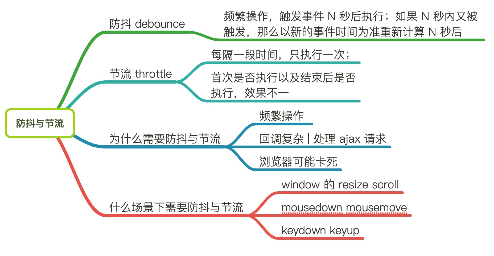

# 防抖与节流



函数节流和去抖的出现场景，一般都伴随着客户端 DOM 的事件监听。

### 防抖
防抖的原理就是：当我们频繁触发事件的时候，触发事件 N 秒后才执行，如果在 N 秒内事件又被触发，那么以新的事件时间为准重新计算。

> 思考这样一个场景，对于浏览器窗口，每做一次 resize 操作，发送一个请求，很显  然，我们需要监听 resize 事件，但是和 mousemove 一样，每缩小（或者放大）一 次浏览器，实际上会触发 N 多次的 resize 事件，用节流？节流只能保证定时触发， 我们一次就好，这就要用去抖。简单的说，函数去抖就是对于一定时间段的连续的函数调用，只让其执行一次。

简易版防抖：
```js
function exec() {

}
_debounce(exec, 1000)

// 只能执行一次
function _debounce(fn, n) {
  setTimeout(fn, n)
}

// 生成太多定时器
function _debounce(fn, n) {
  return funtion() {
    setTimeout(fn, n)
  }
}

// 实现
function _debounce(fn, n) {
  var timer
  return function() {
    clearTimeout(timer)
    timer = setTimeout(fn, n)
  }
}
// 没有绑定 this event, 是否需要立即执行，返回值，取消按钮
```

### 节流
节流的原理是：持续触发事件，每隔一段时间，只执行一次事件。
根据首次是否执行以及结束后是否执行，效果不一；实现方式有时间戳 | 定时器

节流会稀释函数的执行频率

> 举个例子，实现一个原生的拖拽功能（不能用 H5 Drag&Drop API），需要一路监听 > mousemove 事件，在回调中获取元素当前位置，然后重置 dom 的位置（样式改变）。
> 如果我们不加以控制，每移动一定像素而触发的回调数量是会非常惊人的，回调中又伴随> 着 DOM 操作，继而引发浏览器的重排与重绘，性能差的浏览器可能就会直接假死，这样> 的用户体验是非常糟糕的。
> 我们需要做的是**降低触发回调的频率**，比如让它 500ms 触发一次，或者 > > > > 200ms，甚至 100ms，这个阈值不能太大，**太大了拖拽就会失真**，也不能太小，> **太小了低版本浏览器可能就会假**死，这样的解决方案就是函数节流，英文名字叫> > 「throttle」。函数节流的核心是，**让一个函数不要执行得太频繁，减少一些过快的> 调用来节流。**

**使用定时器**

当触发事件的时候，我们设置一个定时器，再触发事件的时候，如果定时器存在，就不执行，直到定时器执行，然后执行函数，清空定时器，这样就可以设置下个定时器。
```js
// 使用定时器
function throttle(func, wait) {
    var timeout;
    var previous = 0;

    return function() {
        context = this;
        args = arguments;
        if (!timeout) {
            timeout = setTimeout(function(){
                timeout = null;
                func.apply(context, args)
            }, wait)
        }

    }
}
```
**使用时间戳**

使用时间戳，当触发事件的时候，我们取出当前的时间戳，然后减去之前的时间戳(最一开始值设为 0 )，如果大于设置的时间周期，就执行函数，然后更新时间戳为当前的时间戳，如果小于，就不执行。
```js
// 使用时间戳
function throttle(func, wait) {
    var context, args;
    var previous = 0;

    return function() {
        var now = +new Date();
        context = this;
        args = arguments;
        if (now - previous > wait) {
            func.apply(context, args);
            previous = now;
        }
    }
}
```
### 使用场景
throttle 应用场景：需要间隔一定时间触发回调来**控制函数调用频率**
- DOM 元素的拖拽功能实现（mousemove）
- 射击游戏的 mousedown/keydown 事件（单位时间只能发射一颗子弹）
- 计算鼠标移动的距离（mousemove）
- Canvas 模拟画板功能（mousemove）
- 搜索联想（keyup）
- 监听滚动事件判断是否到页面底部自动加载更多：给 scroll 加了 debounce 后，只有用户停止滚动后，才会判断是否到了页面底部；如果是 throttle 的话，只要页面滚动就会间隔一段时间判断一次

debounce 应用场景：对于连续的事件响应我们只需要执行一次回调
- 每次 resize/scroll 触发统计事件
- 文本输入的验证（连续输入文字后发送 AJAX 请求进行验证，验证一次就好）

函数节流和函数去抖的核心其实就是限制某一个方法被频繁触发，而一个方法之所以会被频繁触发，大多数情况下是因为 DOM 事件的监听回调，而这也是函数节流以及去抖多数情况下的应用场景。