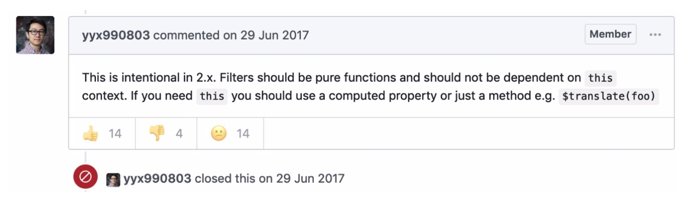

# 深入理解 filter
先来看一个栗子，是我在项目中的错误应用
```js
// 模拟数据
let data = [
	{
		id: '123456',
		state: '1',
		type: '3'
	},
	{
		id: '234561',
		state: '0',
		type: '2'
	},
	{
		id: '456321',
		state: '0',
		type: '1'
	}
]
filters: {
	filterData(data) {
		let typeMap = {
			'1': '操作'
			'2': '错误',
			'3': '其他'
		}
		data.forEach(item => {
			item.type = typeMap[item.type]
		})
		return data
	}
}
```
当处理返回数据时使用 filter 过滤，会造成什么后果?
以上代码通过 filter 处理数据，filter 的 data 被修改，于是 data 会再次被过滤, 最终 type 那一列的值为空，所以再处理这种情况的时候应该要使用 computed

filter: Vue.js 允许你自定义过滤器，可**被用于一些常见的文本格式化**。

过滤器应该是纯函数，不应该依赖于 this 上下文
过滤器里没有上下文
所以 filter 函数里面的this ，在浏览器环境下是 window
