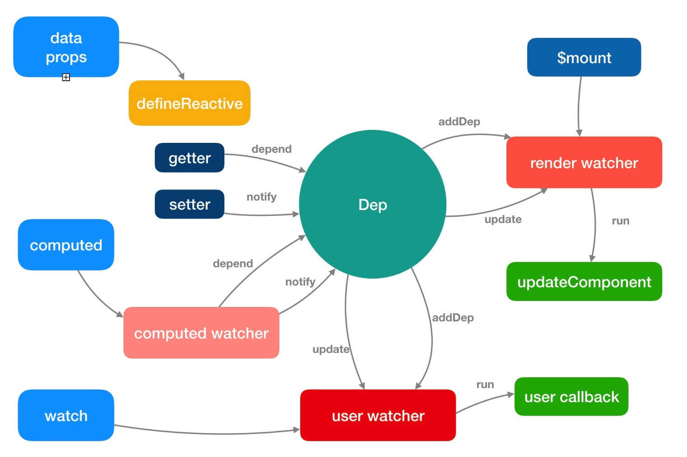

# Vue 响应式原理

## 响应式对象
Vue 实现响应式的核心是使用了 `Object.defineProperty`，这是 Vue 不能兼容 IE8 以下浏览器的原因。
一旦对象拥有了 getter 和 setter，我们可以简单地把这个对象称为响应式对象。
- getter 做的事情是依赖收集
- setter 做的事情是派发更新

## 声明响应式属性
Vue 不允许动态添加根级响应式属性，所以你必须在初始化实例前声明根级响应式属性，哪怕是一个空值。
如果未在 data 选项中声明 XX， Vue 将警告⚠️你渲染函数正在试图访问的属性不存在。

这样的限制是为什么？
- 它消除了在依赖项跟踪系统中的一类**边界情况**
- 使 Vue 实例在**类型检查系统**的帮助下运行的更**高效**
- 在**代码可维护性**方面也有一点重要的考虑：
    - data 对象就像组件状态的概要，
    - 提前声明所有的响应式属性，可以让组件代码在以后重新阅读或其他开发人员阅读时更易于被理解。

## 深入响应式原理
前端开发的两个主要工作是：1是把数据渲染到页面，2是处理用户交互
对应到 Vue 上就是:
1. Vue 把数据渲染到页面
2. 由于用户交互或者其他方面导致数据发生变化重新对页面渲染

传统的做法，当我们处理用户交互改变数据进而重新渲染页面的操作流程是：
1. 监听点击事件
2. 修改数据
3. **手动操作 DOM 重新渲染**

Vue 内部对「手动操作 DOM 重新渲染」做了处理：
1. 判断需要修改哪块的数据
2. 修改效率和性能是不是最优的
3. 对数据的每次修改都去操作 DOM 吗
4. 修改 DOM 的逻辑应该怎么写

