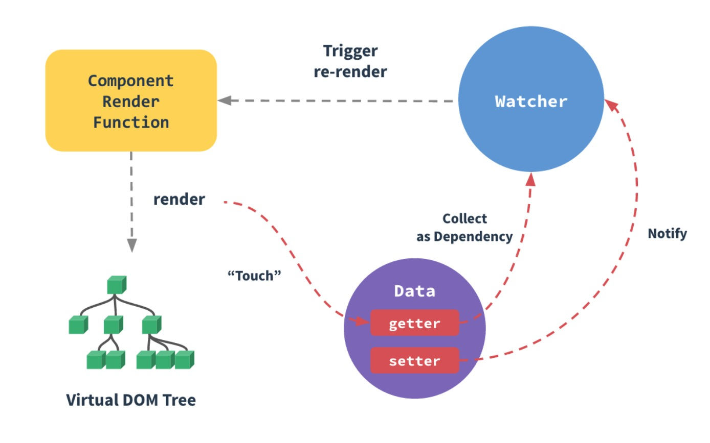

# Vue 检测数组与对象的变化
数据模型仅仅是普通的 JS 对象，修改数据模型，视图会进行更新。

## 如何追踪变化？

普通的 JS 对象传给 Vue 实例的 data 选项，Vue 遍历此对象的所有属性，使用 `Object.defineProperty` 把这些属性全部转为 `getter/setter` ，`getter/setter` 让 Vue 追踪依赖，在属性被访问和修改的时候通知变化。

每个组件实例都有相应的 `watcher` 实例对象，它会在组件渲染的时候把属性记录为依赖，之后当依赖性的 `setter` 被调用时，会通知 `watcher` 重新计算，从而使它关联的组件得到更新。



### 检测对象
受 JS 的限制，Vue **不能检测到对象属性的添加和删除。**
Vue 在初始化实例的时候对属性执行 `getter setter`  的转换
所以属性必须在 `data` 对象上存在才能让 Vue 转换它，这样它才是响应的。

Vue **不允许在已经创建的实例上动态添加新的根级响应式属性**
可以使用 `Vue.set(object, key, value)` 方法将响应属性添加到嵌套的对象上

当向一个已有对象添加多个属性，比如使用 `Object.assign()` 来添加属性。但是，这样添加到对象上的新属性不会触发更新。在这种情况下，你应该用原对象与要混合进去的对象的属性一起创建一个新的对象。

```js
// 代替 `Object.assign(this.someObject, { a: 1, b: 2 })`
this.someObject = Object.assign({}, this.someObject, { a: 1, b: 2 })
```

### 检测数组
由于 JavaScript 的限制，Vue 不能检测以下变动的数组：

1. 当你利用索引直接设置一个项时，例如：`vm.items[indexOfItem] = newValue`
2. 当你修改数组的长度时，例如：`vm.items.length = newLength`

```js
// 解决no.1
// Vue.set
Vue.set(vm.items, indexOfItem, newValue)
// Array.prototype.splice
vm.items.splice(indexOfItem, 1, newValue)

// 解决 no.2
vm.items.splice(newLength)
```